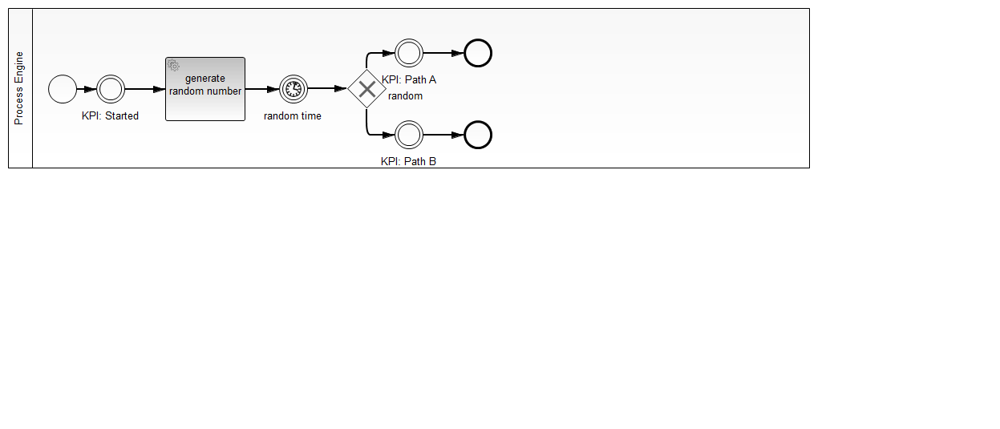

How to put KPIs into your process
=================================

This process applications use intermediate none events to set the milestones used for Key Performance Indicators. Their name has to start with 'KPI: '.

The cockpit plugin ['cockpit-plugin-kpi-view'](../cockpit-plugin-kpi-view) visualizes these KPIs.

This application is built as an example for the cockpit plugin.

After the deployment 100 process instances are started in the `onDeploymentFinished()` event.

Tested environment
------------------ 

camunda BPM 7.3.0 with H2 database.

The process
-----------

