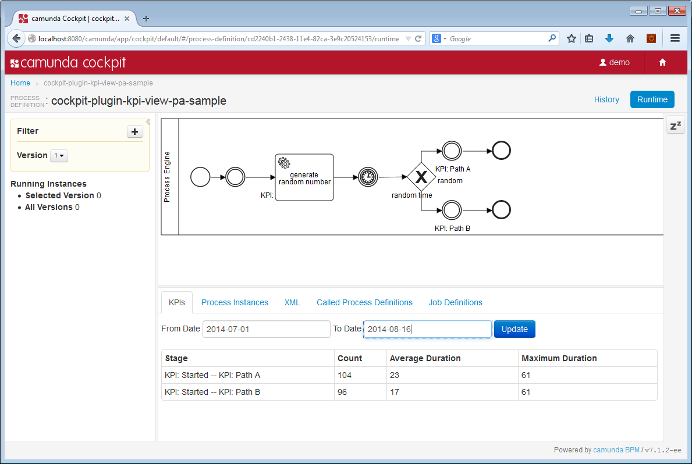

How to measure special KPIs
=========================

This cockpit plugin shows how you could count and evaluate special Key Performance Indicators from your processes.

The plugin relies on intermediate none events with a name started by 'KPI:'. The complete logic is in the [database query](src/main/resources/org/camunda/bpm/demo/cockpit/plugin/kpi/queries/kpi-queries.xml) and you can adjust it for your needs.

In this example, the query calculates the time elapsed between KPI-Events while the process instance is executed.

Then it builds a stage for each occurred combinations of KPI-Events and calculates average and maximum duration of all process instances in these stages.

Example Process Application
---------------------------

An example process application called ['cockpit-plugin-kpi-view-pa-sample'](../cockpit-plugin-kpi-view-pa-sample) is available in this repository. 

Tested Environment
------------------

The plugin is tested on camunda BPM 7.3.0 with H2 database.

